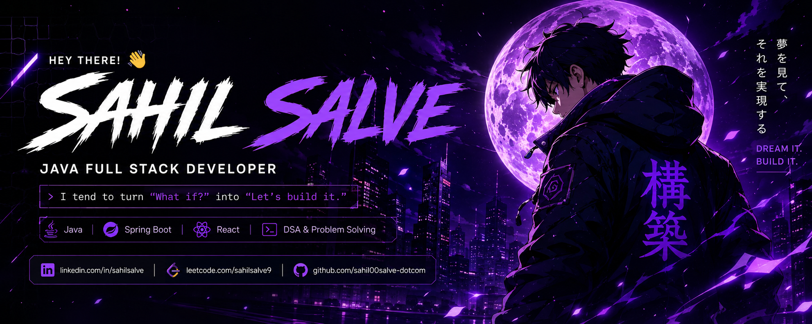

<div align="center">



<br>

# 👋 Hey There! I'm **Sahil Salve**

### Java Full Stack Developer · Backend Builder · Problem Solver

> **`I tend to turn "What if?" into "Let's build it."`**

<br>

<a href="https://www.linkedin.com/in/sahilsalve">

</a>
&nbsp;
<a href="https://leetcode.com/sahilsalve9">

</a>
&nbsp;
<a href="https://github.com/sahil00salve-dotcom">

</a>
&nbsp;
<a href="mailto:sahil00salve@gmail.com">

</a>

</div>

---

## ⚡ ABOUT ME

<table>
<tr>

<td width="55%">

### 👨‍💻 Who I am

I'm a **Java Full Stack Developer** focused on building scalable, efficient and user-focused applications.

I enjoy taking complex problems, breaking them down, understanding how the pieces work together, and turning ideas into real software.

```text
Code. Build. Break. Learn. Repeat.
```

🚀 I like taking things from:

**Idea → Architecture → Code → Production**

</td>

<td width="45%">

### 🎯 CURRENT FOCUS

🧩 **Mastering DSA & Problem Solving**

☕ **Building robust backend systems with Spring Boot**

🏗️ **Learning System Design & Scalable Architecture**

⚛️ **Leveling up in React & Modern Frontend**

🚀 **Shipping real-world, production-grade projects**

</td>

</tr>
</table>

---

# 🛠️ TECH STACK

## ☕ Backend

<p>

</p>

<p>


</p>

## ⚛️ Frontend

<p>

</p>

## 🧰 Tools & DevOps

<p>

</p>

---

# 🚀 FEATURED PROJECT

<table>
<tr>
<td width="100%">

## 🛒 Production-Grade Ecommerce Backend 🔥

A secure, scalable and modular ecommerce backend built with **Spring Boot** and industry-oriented backend practices.

### 🔧 Core Technologies

`Java` · `Spring Boot` · `Spring Security` · `JWT`

`MySQL` · `JPA/Hibernate` · `REST APIs`

`DTO` · `Validation` · `Layered Architecture`

<br>

<a href="https://github.com/sahil00salve-dotcom/02-Backend-Ecommerce">

</a>

</td>
</tr>
</table>

---

# 🧠 DSA & PROBLEM SOLVING

I don't want to just memorize solutions.

I focus on understanding **patterns**, recognizing them quickly, and learning how to solve unfamiliar problems.

```text
Arrays
   ↓
Strings
   ↓
Hashing
   ↓
Two Pointers
   ↓
Sliding Window
   ↓
Stack / Queue
   ↓
Binary Search
   ↓
Linked List
   ↓
Trees
   ↓
Graphs
   ↓
Dynamic Programming
```

### 🏆 LeetCode

<p align="center">

<a href="https://leetcode.com/sahilsalve9">

</a>

</p>

---

# 📊 GITHUB STATS

<p align="center">


</p>

---

# 🔥 GITHUB STREAK

<p align="center">


</p>

---

# 📈 CONTRIBUTION GRAPH

<p align="center">


</p>

---

# 🔥 CURRENTLY BUILDING

```text
┌─────────────────────────────────────────────────┐
│                                                 │
│  🚀  Production-grade Ecommerce Backend        │
│                                                 │
│  🧩  DSA & Interview Problem Solving           │
│                                                 │
│  ☕  Spring Boot & Spring Security              │
│                                                 │
│  🏗️  System Design & Scalable Architecture     │
│                                                 │
│  ⚛️  React & Modern Frontend                   │
│                                                 │
└─────────────────────────────────────────────────┘
```

---

# 🗺️ MY DEVELOPMENT JOURNEY

```text
                    ┌───────────────────┐
                    │   JAVA / OOP      │
                    └─────────┬─────────┘
                              │
                              ▼
                    ┌───────────────────┐
                    │   SPRING BOOT     │
                    └─────────┬─────────┘
                              │
                              ▼
                    ┌───────────────────┐
                    │   REST APIs       │
                    │   & Security      │
                    └─────────┬─────────┘
                              │
                              ▼
                    ┌───────────────────┐
                    │ DATABASES / JPA   │
                    └─────────┬─────────┘
                              │
                              ▼
                    ┌───────────────────┐
                    │ SYSTEM DESIGN     │
                    └─────────┬─────────┘
                              │
                              ▼
                    ┌───────────────────┐
                    │ PRODUCTION        │
                    │ READY SYSTEMS     │
                    └───────────────────┘
```

---

# 🎯 MY MINDSET

<div align="center">

### **What if today is the day that changes everything?**

**Keep building. Keep learning. Keep growing.**

<br>

```java
while (alive) {
    learn();
    code();
    build();
    repeat();
}
```

</div>

---

# 💡 FUN FACT

<div align="center">

### `I tend to turn "What if?" into "Let's build it."`

<br>

That's basically how I approach problems:

**Question → Experiment → Build → Improve**

</div>

---

# 📫 CONNECT WITH ME

<p align="center">

<a href="https://www.linkedin.com/in/sahilsalve">

</a>

<a href="https://leetcode.com/sahilsalve9">

</a>

<a href="https://github.com/sahil00salve-dotcom">

</a>

<a href="mailto:sahil00salve@gmail.com">

</a>

</p>

<br>

<div align="center">

### `Dream it. Build it.`

</div>
